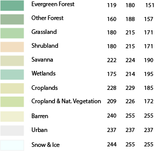

| Classification | Red | Green | Blue |
|-----------------|-----|-----|----|
| Evergreen Forest | 119 | 180 | 151 |
| Other Forest | 160 | 188 | 157 |
| Grassland | 180 | 215 | 171 |
| Shrubland | 180 | 215 | 171 |
| Savanna | 222 | 224 | 190 |
| Wetland | 175 | 214 | 195 |
| Cropland | 228 | 229 | 185 |
| Cropland & Nat. Veg. | 209 | 226 | 172 |
| Barren | 240 | 255 | 255 |
| Urban | 237 | 237 | 237 |
| Snow and Ice | 244 | 255 | 255 |

